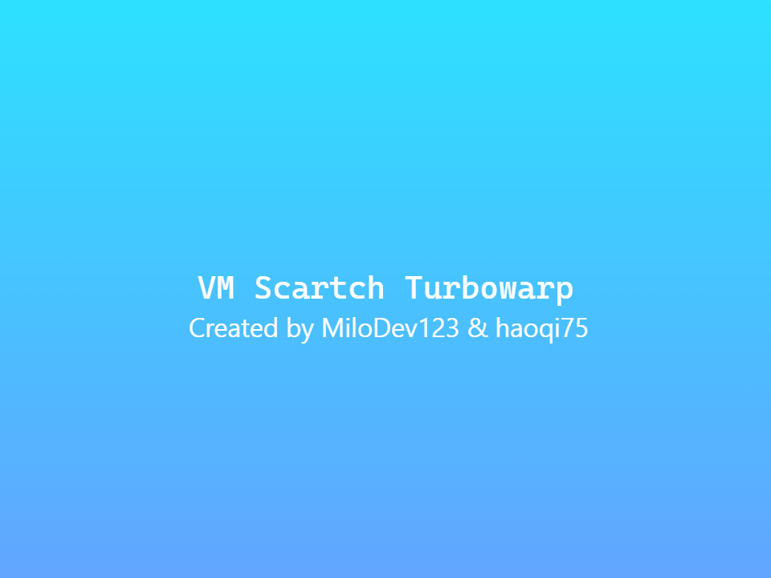

# VM Scratch Turbowarp

Scartch/Turbowarp virtual machines UI, extension created by [MiloDev123/TW-VME](https://github.com/MiloDev123/TW-VME).

### Programs I Use
[TurboWarp Packager](https://packager.turbowarp.org/) / [Resource Hacker](https://www.angusj.com/resourcehacker/) / [Enigma Virtual Box](https://enigmaprotector.com/en/aboutvb.html)

### Features
- Beautiful UI
- Dark theme
- Multi-language (beta): English, Simplified Chinese and Spanish
- Settings saved to local storage
- Status bar (battery and clock)

### Supported Systems
- [x] Linux 2.6
- [x] FreeDOS
- [x] OpenBSD
- [x] KolibriOS
- [x] Damn Small Linux
- [x] Windows 7

### Try Demo
[Scratch](https://scratch.mit.edu/projects/1201556009)

### Download
Download the latest file from [Releases](https://github.com/haoqi75/st-virtual-machine/releases).
There are 2 files on the download page:
- ``VM.vX.X.X.sb3``: TurboWarp work file
- ``st-virtual-machine-64-X.X.X.exe``: Windows single executable file (64-bit only)
- Not recommended for use on Android.
